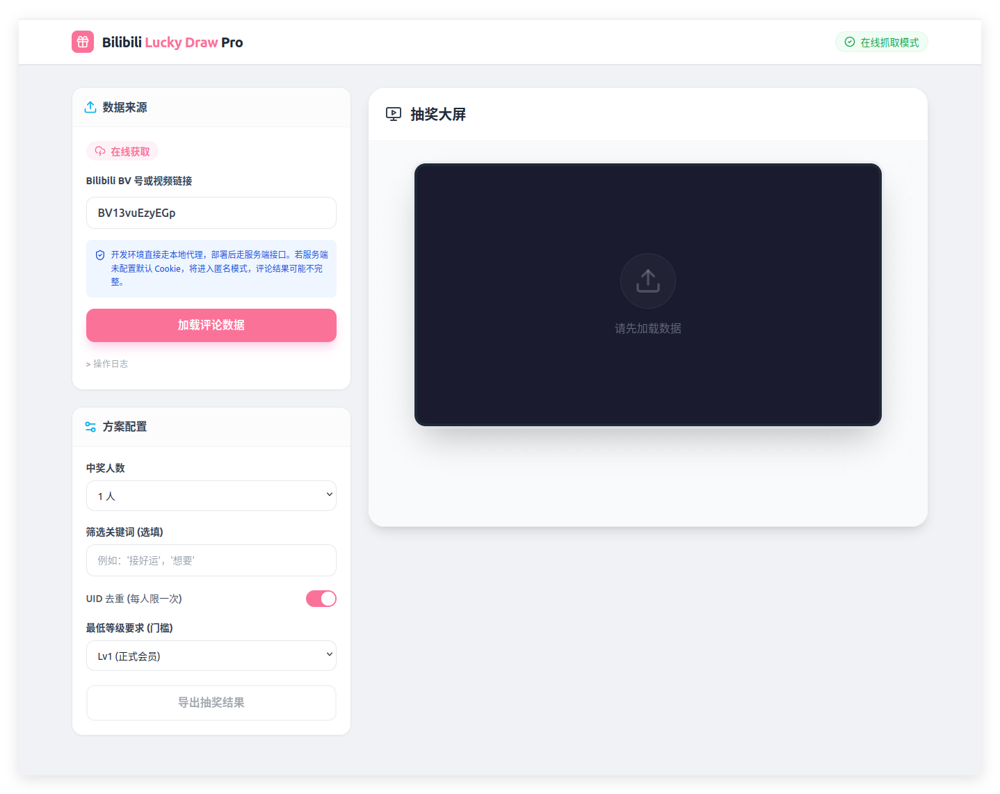

# Bilibili Lucky Draw

一个用于 B 站评论抽奖的在线工具。输入 `BV` 号或完整视频链接后，项目会通过本地/服务端代理抓取评论，筛选候选人，并完成抽奖。

## Screenshots

## 当前功能

- 自动识别 `BV` 号和视频链接
- 抓取主评论与楼中楼评论
- 按关键词、用户等级过滤
- 按 UID 去重
- 支持抽取多名中奖者
- 已中奖用户自动排除
- 支持机器人/抽奖号动态审核与自动重抽
- 导出抽奖结果为 JSON
- 支持默认 Cookie 模式与匿名模式

## 本地运行

前置条件：

- Node.js 18+

启动步骤：

1. 安装依赖：`npm install`
2. 可选：复制 `.env.example` 为 `.env.local`
3. 如需提高评论抓取完整度，在 `.env.local` 中填写 `BILIBILI_COOKIE`
4. 启动开发环境：`npm run dev`

开发模式下，Vite 会直接提供 `/api/proxy`，不需要额外本地后端。

## Cookie 配置

为了提高评论抓取稳定性和完整度，代理层支持读取环境变量 `BILIBILI_COOKIE`。

- 配置了 `BILIBILI_COOKIE`
  服务端会携带默认登录态请求 B 站接口，用户前端可以不登录直接使用。
- 未配置 `BILIBILI_COOKIE`
  项目会以匿名模式运行，仍可使用，但部分视频可能只能抓到少量评论。

建议：

- 单独准备一个 B 站小号 Cookie
- 定期检查 Cookie 是否失效
- 不要把 `.env.local` 提交到仓库

## 机器人过滤

抽奖支持在锁定中奖者前自动审核候选账号：

- 可配置最低等级、转发率阈值、抽奖词密度阈值
- 支持动态不可见策略与动态样本数配置
- 审核失败后自动重抽，直到达到最大重试次数
- 导出的 JSON 会包含审核快照和被跳过账号摘要

说明：

- 审核依赖用户空间动态接口，可能受 B 站风控影响
- 建议为服务端配置 `BILIBILI_COOKIE` 以提高稳定性
- 网络异常时系统会记录 warning 并默认放行，以避免中断抽奖流程

## 构建

执行：

`npm run build`

## 部署

项目可以部署到支持 Node 运行时的环境，例如 Vercel。

部署时建议：

1. 在部署平台配置环境变量 `BILIBILI_COOKIE`
2. 部署后先验证 `/api/proxy?type=status`
3. 确认返回 `hasConfiguredCookie: true`
4. 再实际测试一个公开视频的评论抓取

## 说明

- 在线抓取依赖 B 站接口，接口风控、请求策略或返回结构变化时，抓取行为可能受到影响。
- 匿名模式下，页面会主动提示“结果可能不完整”。
- 如果头像外链加载失败，界面会回退为用户名首字占位，不会出现空白头像位。
